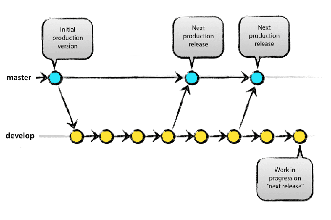
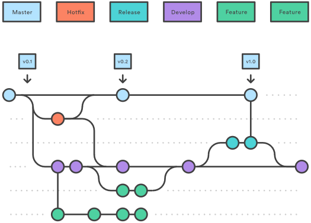
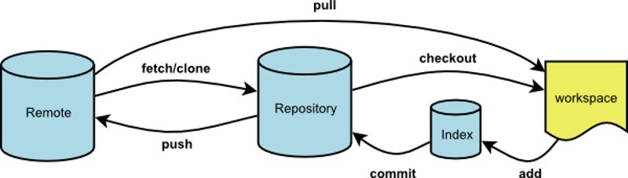

Git Workflow
==================

## 什么是Git工作流 ##

  Git是一种版本控制系统，用于跟踪计算机文件的变化，并协调多个文件中的这些文件。它主要用于软件开发中的源代码管理，但它可以用来跟踪任何一组文件中的更改。作为一个分布式的修订控制系统，它的目标是速度、数据完整性以及对分布式、非线性工作流的支持。Git工作流是如何使用Git以一致和高效的方式完成工作的配方或建议。Git工作流鼓励用户有效和一致地利用Git。有几个公开的Git工作流可能适合您的团队。

- 集中流

 集中式工作流对小团队非常有用。随着团队规模的扩大，冲突解决过程会形成瓶颈。

 

- 分支流

 分支流是集中式工作流的逻辑扩展。功能分支工作流的核心思想是，所有功能开发都应该在专用分支而不是主分支中进行。

- 工作流

 工作流定义了一个严格的gitflow分支模型设计项目发布。这为管理大型项目提供了一个健壮的框架。它非常适合有计划发布周期的项目。它赋予特定角色的不同分支，定义如何以及何时应该互动。 

- 分支流

 它给开发者一个服务器端的存储库而不是使用单一的服务器端库作为“中心”的代码。这意味着每个人都不是一个，而是两个Git存储库：一个私人的和一个公共服务器端的。 

 

 当在一个Git管理的项目上与团队合作时，重要的是确保团队对如何应用变更流程达成一致意见。确保团队在同一个页面，在Git工作流约定应开发或选择。 

## 为什么使用Git工作流 ##

- 良好地支持非线性开发
  
  Git支持快速分支和合并，并包含可视化和导航非线性开发历史的特定工具。在Git中，一个核心假设是，一个变更将被合并，比它所写的要频繁，因为它被传递给不同的审阅者。在Git中，分支非常轻量级：一个分支只是对一个提交的引用。有了它的父母承诺，可以构建完整的分支结构。

- 分布式开发  Git给每个开发人员一个完整开发历史的本地副本，并将更改从一个这样的存储库复制到另一个存储库。这些更改是作为附加的开发分支导入的，并且可以以与本地开发的分支相同的方式合并。

- 有效处理大型项目

  它比某些版本控制系统快一个数量级，从本地存储库中获取版本历史比从远程服务器获取版本历史要快一百倍。

- ...

## 如何使用 ##

1.存储库。
2.克隆你的叉子。
3.为正在处理的问题创建一个新分支。这个问题可以是特性、修复、文档等。
4.解决这个问题。
5.申请提交上一座冰山，如果出现矛盾，解决它们。（rebase）
6.添加和提交
7.将远程引用连同相关对象一起更新（PUSH）
8.转到上游回购并启动一个拉动请求（PR）。详细描述你完成给定任务时所做的事情，参考你所研究的问题。然后等待您的代码进行审核并合并到上游回购协议中。
9.当你的PR被合并后，同步你的叉子到上游。
10.删除你工作的分支。

## Reference ##

https://www.atlassian.com/git/tutorials/comparing-workflows

https://github.com/xirong/my-git/blob/master/git-workflow-tutorial.md

https://en.wikipedia.org/wiki/Git

https://github.com/cudevgroup/git-workflow-tutorial

http://blog.csdn.net/wankui/article/details/52029246

